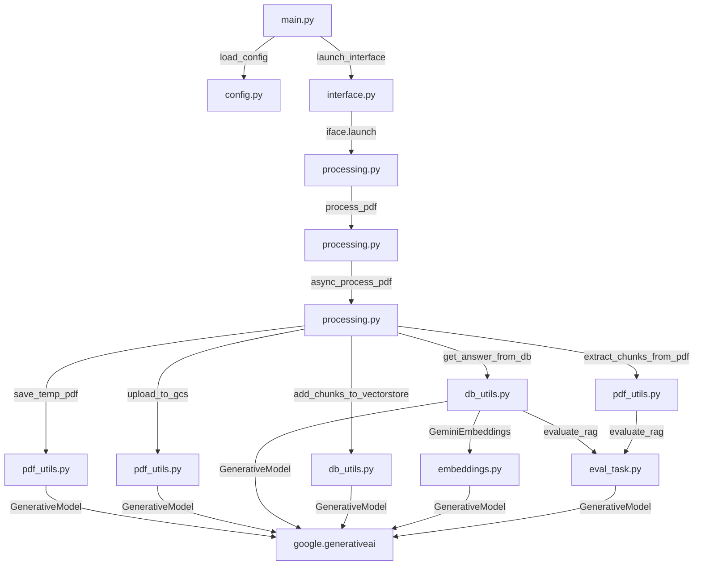

# Getting started
- このアプリケーションは、Langchainを用いてGoogle Cloud Evaluation SDKとRAGの性能を評価するためのものです。
- 同様の環境で動作させるため、以下の初期セットアップを完了させてください
- 筆者の環境はMacOS.Xとなるため、実行する環境によっては差分が出る可能性があります。あらかじめご了承ください

## 前提条件
- `venv` で `Python 3.10` を使用してください。
- `pip` (Pythonパッケージマネージャ)を使用してください。

## セットアップ
1. 当該リポジトリをクローンします。

```bash
git clone <リポジトリURL>
cd gemini-eval-langchain
```

2. 仮想環境を作成し、アクティベートします。
```bash
python3.10 -m venv venv
source ./venv/bin/activate # Windowsの場合は .\venv\Scripts\activate
```

3. 必要なパッケージをインストールします。

```bash
pip install -r requirements.txt
```

4. 環境変数を設定します。`.env.example`をコピーしてプロジェクトルートに、`.env`ファイルを作成し、必要なAPI_KEYなどを設定します。

```.env
# Google CloudのProjectID
PROJECT_ID=

# GCS BUCKET
GCS_BUCKET_NAME=

# PDFのテキストをチャンク化するサイズ
CHUNK_SIZE=500

# ベクトル検索における類似検索数
SIMILARITY_SEARCH_K=10
"""
注:
多ければ多いほどTOKENは消費するがコンテキスト数が増えるので精度が上がる傾向はあるものの
コンテキストが増えるほどGeminiで処理できるtoken制限に引っかかる可能性があるため注意
"""

"""GEMINI(デフォルト)"""
# APIKEY
GEMINI_API_KEY=
# ベクトル化モデル
EMBED_MODEL=models/text-embedding-004
# GEMINI APIモデル
GEMINI_MODEL=gemini-1.5-flash-001
# GEMINI_MODEL=gemini-1.5-pro-001


"""OPENAIを使う場合"""
## APIKEY
OPENAI_API_KEY=
## ベクトル化モデル
# EMBED_MODEL=text-embedding-ada-002
```

## 起動方法
- 以下のコマンドでアプリケーションを起動します。

```bash
python ./app/main.py
```

## 使用方法
1. ブラウザで`http://localhost:7860`を開きます
2. PDFファイルをアップロードし、Submitをクリックします
3. PDFがDBにベクトル化されるので、それ以降は質問を送信することができます
4. 質問を送信すると、既存DBから回答をが返されます
5. 同時に評価結果サマリーとディティールも表示されます

## ファイル構成
- `app/main.py`: アプリケーションのエントリーポイント
- `app/utils/answer_utils.py`: 質問応答のためのユーティリティ
- `app/utils/db_utils.py`: データベース関連のユーティリティ
- `app/utils/interface.py`: Gradioインターフェースの設定
- `app/utils/pdf_utils.py`: PDF処理のためのユーティリティ
- `app/utils/processing.py`: PDFの処理とクエリに対する回答生成
- `app/utils/eval_task.py`: RAGの評価を行うためのユーティリティ
- `app/utils/embeddings.py`: ベクトル化処理を行うためのユーティリティ

## 依存関係
- 以下依存関係を持ちます。



## 注意事項
- 環境変数の設定が正しいことを確認してください。
- 必要なAPIキーを取得し、`.env` ファイルに設定してください。

以上でセットアップと起動方法の説明は終了です。問題が発生した場合は、リポジトリのIssueに報告してください。
